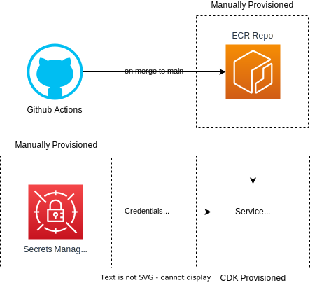

# CI / CD Architecture

The Continuous Integration and Continuous Delivery (CI / CD) pipeline is
provisioned by Github Actions with [Amazon Web Services](https://aws.amazon.com/).

## High-Level Overview

[Github Actions](https://github.com/aws-actions) has AWS integrations available. Upon merging a pull request
to `main`, Github Actions builds and pushes an image to [Elastic Container Registry](https://aws.amazon.com/ecr/) (ECR).
The service infrastructure (eg. Lambda) is provisioned by [AWS CDK](https://aws.amazon.com/cdk/), which reads from
the ECR repo. Any sensitive credentials (eg. Twitter Access Tokens) are read from
[Secrets Manager](https://aws.amazon.com/secrets-manager/), which is manually provisioned. The ECR repos themselves
are manually provisioned to ensure the repo exists before images are pushed or read.
